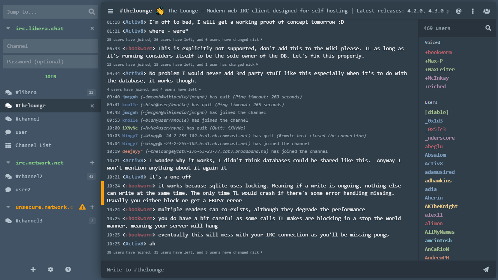
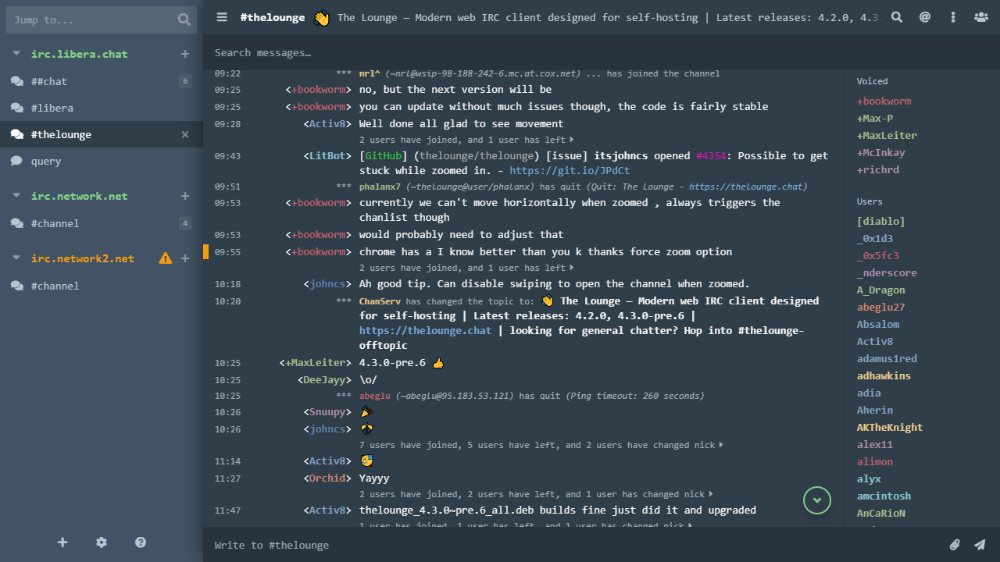

# New Morning (Compact)
Compact version of *[New Morning theme](https://www.npmjs.com/package/thelounge-theme-new-morning)* for [The Lounge](https://thelounge.chat/) self-hosted web IRC client. Based on stock *Morning* theme.

### Compact Layout

### Optional Flex Layout

## Features
- Updated to The Lounge 4.3.0-Pre.6 with styled message search bar.
- Compact, mobile like layout by default. Flex layout can be renabled via MOTD toggle.
- Monospace font.
- Hidden logos.
- Sidebar made slightly larger by default and can be resized by dragging it in bottom right corner (left of chat input box).
- Restyled channel join inputs and button.
- Restyled standard and condensed status messages.
- Restyled message highlights.
- Adjusted density for touchscreen devices.
- Bunch of other tweaks and fixes.

## Re-enabling Flex Layout
Stock-like flex layout can be enabled in settings via MOTD toggle which now helpfully reads *Show MOTD and enable classic view*.

## Requirements
Tested on The Lounge 4.3.0-Pre.6.

## Install
`thelounge install thelounge-theme-new-morning-compact`

## Acknowledgements
Nick colors taken from [thelounge-theme-nord](https://www.npmjs.com/package/thelounge-theme-nord).
Original new morning theme can be found [here](https://www.npmjs.com/package/thelounge-theme-new-morning).