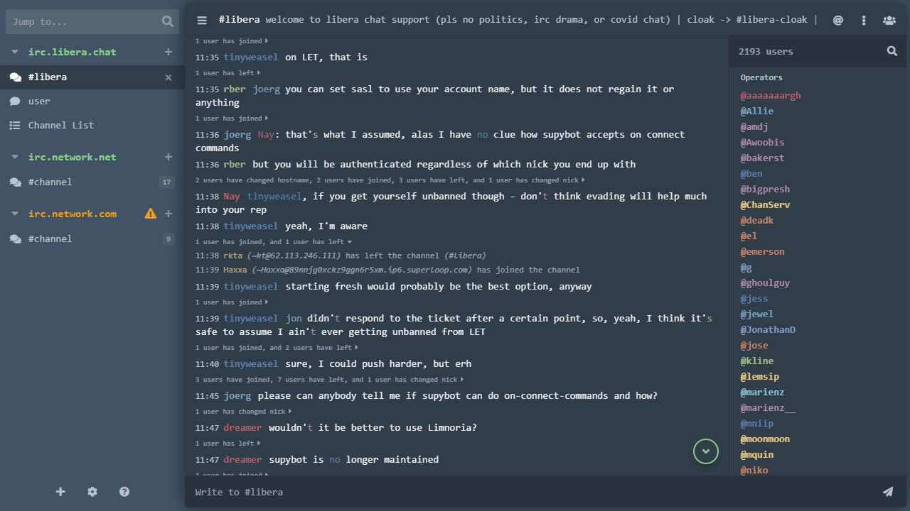

# New Morning (Compact)
Compact version of [New Morning theme](https://www.npmjs.com/package/thelounge-theme-new-morning) for *[The Lounge](https://thelounge.chat/)* self-hosted web IRC client. Based on stock *Morning* theme.

## Features
- Monospace font.
- Hidden logos.
- Sidebar made slightly larger by default and can be resized by dragging it in bottom right corner (left of chat input box).
- Restyled channel join inputs and button.
- Restyled standard and condensed status messages.
- Bunch of other tweaks and fixes.

## Requirements
Tested on The Lounge 4.2.0.

## Install
`thelounge install thelounge-theme-new-morning-compact`

## Acknowledgements
Nick colors taken from [thelounge-theme-nord](https://www.npmjs.com/package/thelounge-theme-nord).
Original new morning theme can be found [here](https://www.npmjs.com/package/thelounge-theme-new-morning).
