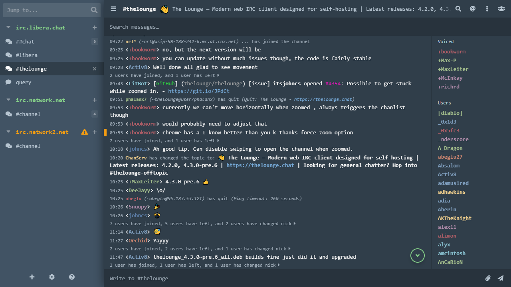

# New Morning (Compact)
Compact version of *[New Morning theme](https://www.npmjs.com/package/thelounge-theme-new-morning)* for [The Lounge](https://thelounge.chat/) self-hosted web IRC client. Based on stock *Morning* theme.

### Compact Layout


### Optional Flex Layout


## Features
- Compact, mobile like layout by default. Flex layout can be renabled via CSS snippet.
- Monospace font.
- Hidden logos.
- Sidebar made slightly larger by default and can be resized by dragging it in bottom right corner (left of chat input box).
- Restyled channel join inputs and button.
- Restyled standard and condensed status messages.
- Restyled message highlights.
- Bunch of other tweaks and fixes.

## Re-enabling Flex Layout
To enable stock-like flex layout, add following css to custom CSS field in settings.

```
@media (min-width: 479px) {
	#chat .msg {
		display: flex;
   		align-items: baseline;
	}

	#chat-container #chat .msg .from {
		width: 120px;
		padding-right: 10px;
		-webkit-mask-image: linear-gradient(270deg,transparent,#000 10px);
		mask-image: linear-gradient(270deg,transparent,#000 10px);
	}

	#chat-container #chat .msg[data-type="condensed"] .condensed-summary .time {
		display: inherit;
	}

	#chat-container #chat .msg:not([data-from][data-type=message]):not([data-from][data-type=notice]) .from {
		font-size: inherit;
	}
}
```

## Requirements
Tested on The Lounge 4.2.0.

## Install
`thelounge install thelounge-theme-new-morning-compact`

## Acknowledgements
Nick colors taken from [thelounge-theme-nord](https://www.npmjs.com/package/thelounge-theme-nord).
Original new morning theme can be found [here](https://www.npmjs.com/package/thelounge-theme-new-morning).